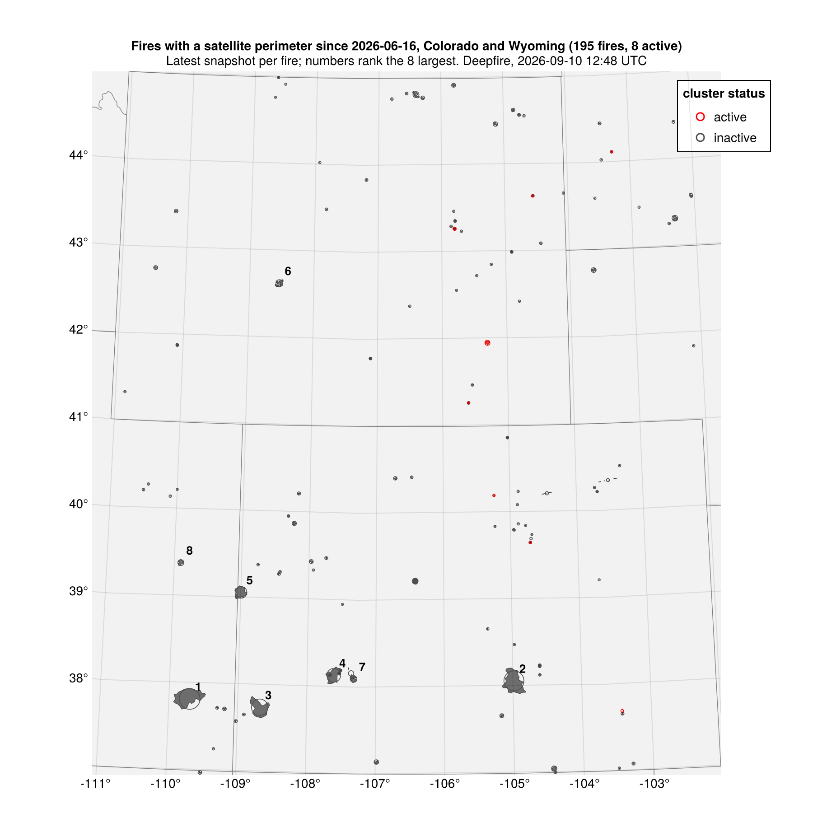
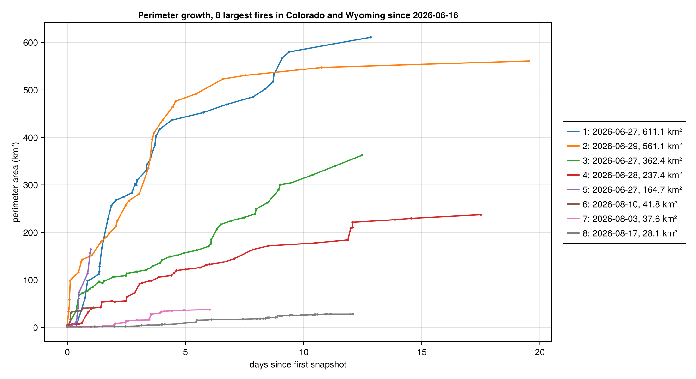

Bounding box -111.06 to -102.04 longitude, 36.99 to 45.0 latitude. Hotspot coverage for this region starts 2026-02-05; perimeters start 2026-06-16 (see [Data coverage](coverage.qmd)). Everything on this page comes from `scripts/colorado_wyoming.jl`.

## Every fire with a perimeter

## Growth curves



Snapshots are only written when the perimeter changes materially, so flat stretches with no points mean no change was recorded, not missing data.

## Perimeter growth animations

Each frame is one perimeter snapshot. Gray outlines are earlier snapshots; the red fill is the current one. The right panel tracks perimeter area.

### Fire 1



### Fire 2



### Fire 3



### Fire 4



## Region, one frame per day

Red perimeters were updated within the previous two days; gray ones are the last known perimeter of a fire that has not changed since.


