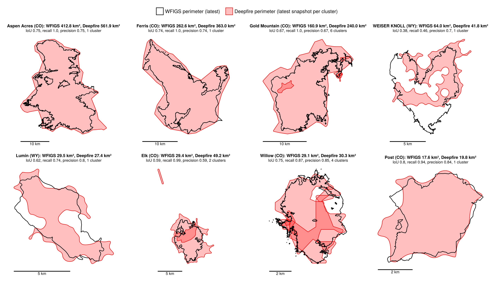
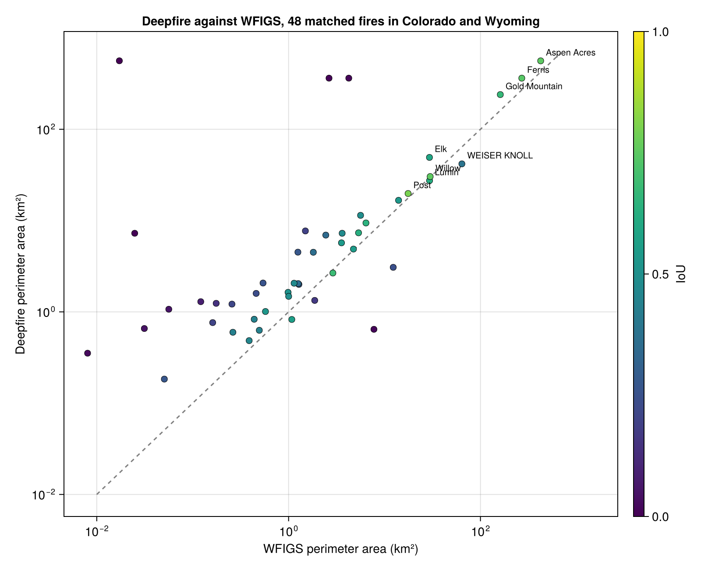

Deepfire perimeters are hulls around satellite hotspot detections. This page compares them with the official perimeters in [WFIGS](https://data-nifc.opendata.arcgis.com/) (Wildland Fire Interagency Geospatial Services), the interagency source that NIFC publishes. Region: Colorado and Wyoming; fires discovered since 2026-06-01. Produced by `scripts/wfigs_comparison.jl`.

## Method

- WFIGS: the `WFIGS_Interagency_Perimeters_YearToDate` feature service, filtered to `US-CO` and `US-WY`. One polygon per incident, the most recent mapped perimeter. Mapping method varies (IR flights, GPS, image interpretation, "Mixed Methods").
- Deepfire: every perimeter snapshot in the region, reduced to the latest snapshot per cluster.
- Each WFIGS polygon is matched to all Deepfire perimeters that intersect it. Metrics use the union of those perimeters, so a fire that Deepfire split into several clusters is still scored as one fire.
- IoU is intersection over union. Recall is the share of the WFIGS polygon that Deepfire covers. Precision is the share of the Deepfire perimeter that lies inside the WFIGS polygon.
- Timing: hours from the WFIGS discovery time to the first hotspot in the matched clusters, and to the first perimeter snapshot.

## Detection by fire size



## Fires of 1000 acres and more



## Overlays

## Caveats

- Deepfire perimeters inherit the footprint of the detecting pixels (375 m for VIIRS, 2 km for GOES), so they extend beyond the burned area. Low precision on small fires is expected.
- WFIGS perimeters are only as current as the last mapping flight or field update, and small fires often have a perimeter drawn once and never revised. Neither source is ground truth.
- Perimeter dates differ between sources. The comparison uses the latest polygon on each side regardless of date.
- Deepfire clusters can merge neighboring fires or split one fire; the cluster count column shows splits, but merges appear as low precision.
