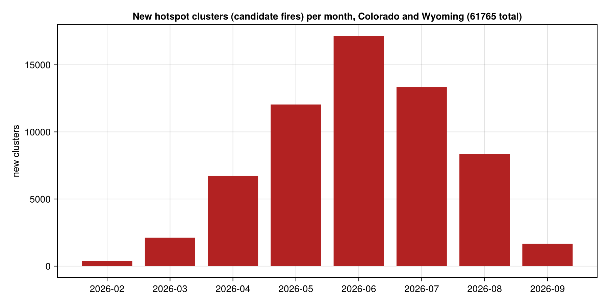

## Summary

- The documentation states hotspot history since January 2025. In practice the 2025 record is Meteosat Third Generation (`MTG_I1`) detections over Europe and North Africa only. No hotspots exist over the contiguous US before February 2026.
- Colorado and Wyoming hotspots and clusters start 2026-02-05. Perimeter snapshots start 2026-06-16 everywhere.
- **The Marshall Fire (Boulder County, 2021-12-30) is not in Deepfire.** Nothing before 2025 is, and nothing in the US before 2026. The same applies to the 2025 Colorado season (for example the Lee Fire near Meeker, August 2025): no detections are returned for that area and period.
- Deepfire has no fire names or incident metadata yet. An `official-incidents` collection is listed as coming soon. Fires can only be identified by location, dates, and `cluster_id`.

## Probe results

Each row is one `hotspots` query with a bounding box and an `observed_at` window, capped at 1000 features. Produced by `scripts/coverage.jl`.



## Candidate fires per month, Colorado and Wyoming

## Historical perimeters from other sources

For fires before 2026, use the sources below. Deepfire could then serve as the near-real-time layer alongside them.

| source | coverage | contents |
|---|---|---|
| [NIFC Open Data](https://data-nifc.opendata.arcgis.com/) | US, 2020 to present (WFIGS); historic perimeters back to the 1800s | official incident perimeters, including the Marshall Fire |
| [MTBS](https://www.mtbs.gov/) | US, 1984 to present | burn severity and perimeters for fires over 1000 acres (500 in the East) |
| [NASA FIRMS](https://firms.modaps.eosdis.nasa.gov/) | global, MODIS since 2000, VIIRS since 2012 | hotspot detections; the same raw inputs Deepfire clusters |
| [GeoMAC archive](https://data-nifc.opendata.arcgis.com/) | US, 2000 to 2019 | daily incident perimeters, superseded by WFIGS |
