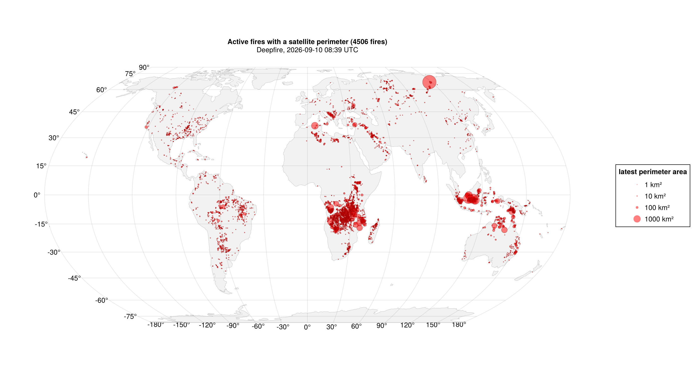
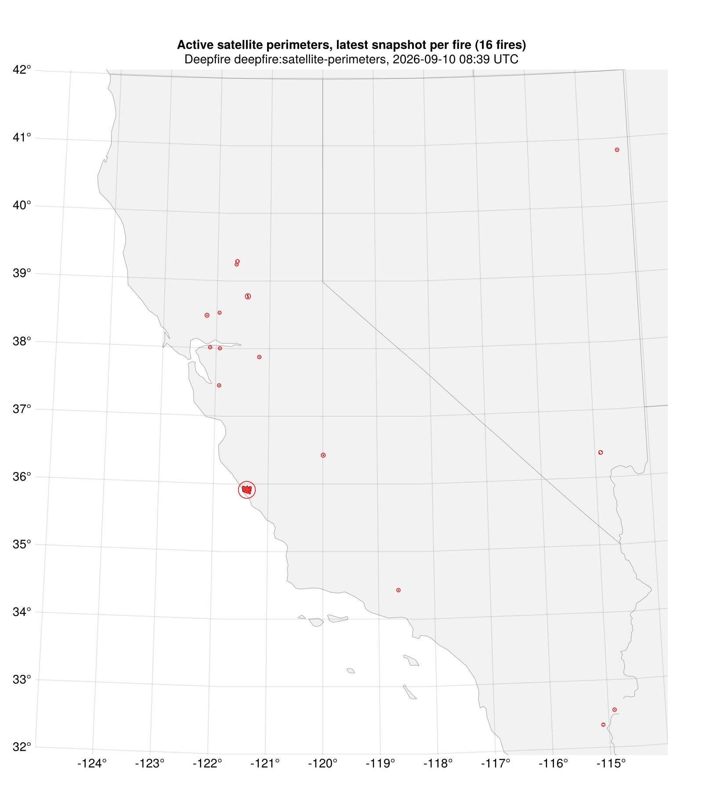
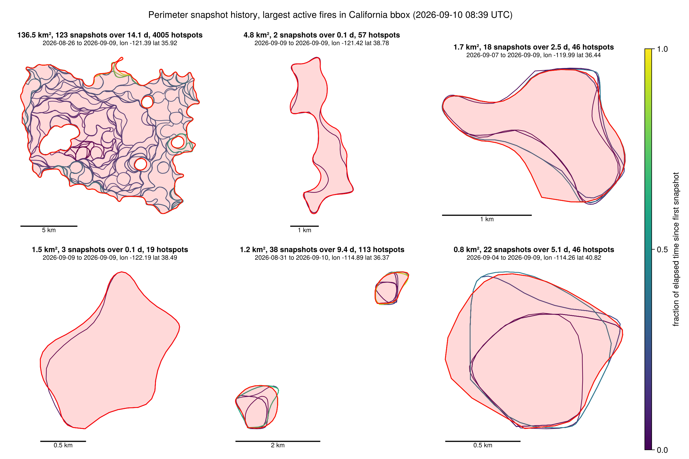

[Deepfire](https://docs.deepfire.co/) is a wildfire intelligence API. It ingests satellite hotspot detections from VIIRS, GOES, MODIS, Sentinel-3, and Meteosat (MTG), clusters them into candidate fires, and estimates fire perimeters from the clusters. Access is through an [OGC API - Features](https://ogcapi.ogc.org/features/) endpoint with CQL2 filtering. See [API notes](docs/api-notes.md) for the endpoint and collection reference.

This site is rendered from figures produced by the Julia scripts in [`scripts/`](https://github.com/NSF-ASCEND-Engine/deepfire-explore/tree/main/scripts). The scripts call the API with credentials from a local `.env` file. The rendered site contains no credentials.

## Collections

| collection | geometry | starts | contents |
|---|---|---|---|
| `hotspots` | Point | Jan 2025 (Europe, Meteosat only); Feb 2026 for the US | per-satellite detections |
| `clusters` | Point | same as hotspots | candidate fires: hotspots grouped in space and time |
| `satellite-perimeters` | MultiPolygon | 2026-06-16 | timestamped perimeter snapshots per cluster |
| `static-heat-sources` | | | persistent anomaly mask |

Perimeters are `circle-union-v2` hulls around hotspot detections, not surveyed boundaries. A cluster gets a new snapshot whenever its geometry changes materially, so the growth history of a fire is the sequence of snapshots sharing a `cluster_id`.

## Active perimeters, 2026-09-10

Produced by `scripts/plot_perimeters.jl`.
